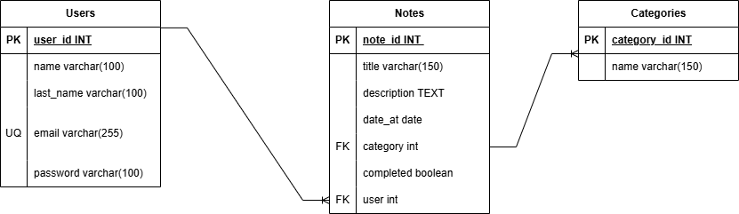

# app notes

## modelado y entidades

### users **(ED)**

- user_id **(PK)**
- name
- last_name
- email **(UQ)**

### notes **(ED)**

- note_id **(PK)**
- title
- description
- date_at
- category **(FK)**
- completed
- user **(FK)**

### categories **(EC)**

- category_id **(PK)**
- name

## relaciones

1. un **usuario** _posee_ muchas **notas** (_1 a M_).
1. una **nota** _tiene_ una **categoria** (_1 a M_).

## diagramas

## reglas de negocio

### usuarios

1.  registrar usuario
1.  eliminar usuario (tambien sus notas asociadas)
1.  editar usuario

### notas

1. crear notas
1. editar una nota en particular
1. eliminar una nota en particular
1. visualizar una nota en particular
1. visualizar todas las notas

### categorias

1. crear categorias
1. editar una categoria en particular
1. eliminar una categoria en particular
1. visualizar una categoria en particular
1. visualizar todas las categorias
